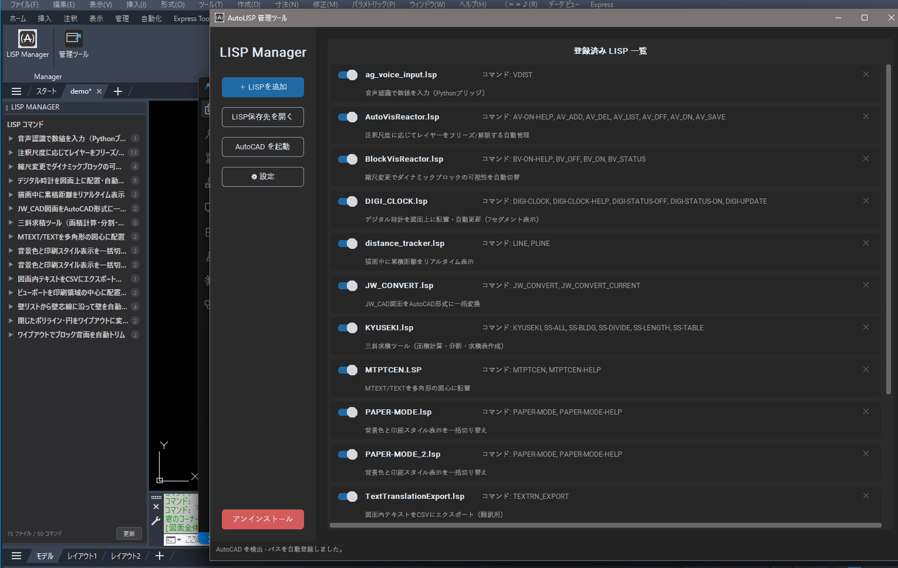
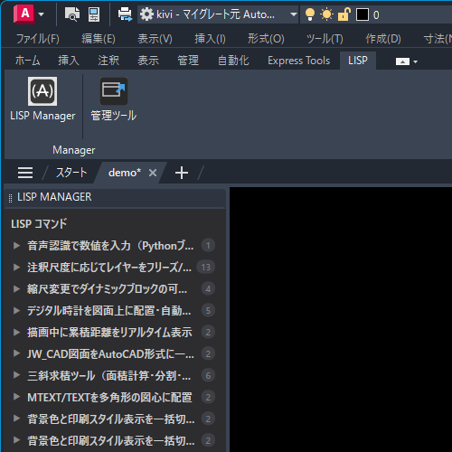

# AutoLISP 管理ツール

AutoCAD の AutoLISPファイルをかんたんに管理するデスクトップアプリです。

---

## ダウンロード

👉 **[最新版をダウンロード（GitHub Releases）](https://github.com/shinji-kivi/autolisp-manager/releases/latest)**

`Setup_AutoLISP管理ツール_1.0.0.exe` を実行してインストールしてください。
管理者権限は不要です（ユーザーローカルにインストールされます）。

> ⚠️ Windows SmartScreen の警告が出る場合は「詳細情報」→「実行」を選択してください。

---

## 機能

| 機能 | 内容 |
|------|------|
| **スタートアップ登録** | AutoCAD 起動時に自動ロードする LISP を登録 |
| **有効 / 無効 切り替え** | スイッチ1つでロードのオン・オフ |
| **コマンド表示** | 各 LISP が定義するコマンド名を自動抽出・表示 |
| **リポジトリ管理** | LISPファイルを指定フォルダに自動コピー・重複リネーム |
| **TRUSTEDPATHS 自動登録** | インストール時およびアプリ起動時にセキュリティパスを自動登録 |
| **AutoCAD リボンパネル** | AutoCAD のリボンに LISP Manager タブを追加（パネル表示トグル・管理ツール起動） |
| **完全アンインストール** | レジストリ・設定ファイル・リボンパネルをすべてクリーンアップ |

---

## 使い方

> **📁 バックアップのおすすめ**
> 追加したLISPファイルはアプリが管理する専用フォルダに自動コピーされますが、「×」ボタンや初期化操作を行うとそのフォルダからも削除されます。大切なLISPファイルは、アプリとは別の場所にも控えを保存しておくことをおすすめします。

1. インストーラーを実行（インストール完了後にアプリが自動起動します）
2. **「LISP を追加」** ボタンからファイルを選択、またはアプリの画面に直接ドラッグ＆ドロップで LISPファイルを登録
   （LISPファイルは移動ではなく、指定フォルダにコピーされます）
3. AutoCAD を起動すると登録した LISP が自動でロードされます
4. スイッチで有効 / 無効を切り替え
5. 不要なファイルは各ファイル右側の **「×」ボタン** で削除できます（登録先フォルダからも削除されるので注意）
6. AutoCAD のリボンに追加される **「LISP Manager」タブ** からもアプリを起動できます

### AutoCAD リボン & パレット

インストール後、AutoCAD のリボンに「LISP Manager」タブが追加されます。
パレットには登録した全コマンドが日本語で一覧表示され、ボタンをクリックするだけで実行できます。
各LISPに `-HELP` コマンドが定義されている場合は、パレットのヘルプボタンから使い方を確認できます。

### 初回起動時の注意

インストーラーが AutoCAD の信頼済みパス（TRUSTEDPATHS）を自動登録するため、通常はセキュリティダイアログは表示されません。

万が一表示された場合は **「常にロード」または「1回のみロード」** を選択してください。

---

## 動作環境

- Windows 10 / 11（64bit）
- AutoCAD 2026 / 2027

---

## アンインストール

Windows の「設定」→「アプリ」→「AutoLISP管理ツール」からアンインストールできます。
アプリ内の「アンインストール」ボタンからも実行可能です。

以下が自動的に削除されます:

| 削除対象 | 内容 |
|---------|------|
| アプリ本体 | `%LOCALAPPDATA%\AutoLISP管理ツール` |
| リボンパネル | `%APPDATA%\Autodesk\ApplicationPlugins\AutoLispPanel.bundle` |
| LISP リポジトリ | `%APPDATA%\Autodesk\ApplicationPlugins\Tool_LISP`（カスタムパス設定時のみ） |
| 設定ファイル | `%APPDATA%\.lisp_manager_config.json` |
| レジストリ | TRUSTEDPATHS / ACAD から登録パスを除去 |

---

## ドキュメント

- **[LISP 開発者へ](LISP開発者へ.md)** — パレットに日本語ボタンを表示する方法・テンプレート
- **[ビルド手順](ビルド手順.md)** — 仕組み・ビルド手順・プロジェクト構成

---

## ライセンス

[MIT License](LICENSE)

自由に使用・配布・改変できます。著作権表示（`Copyright (c) 2026 studio kivi`）を残してください。

---

## 作者

**studio kivi**
AutoCAD を使う建築・設計事務所のための小さなツールを作っています。
